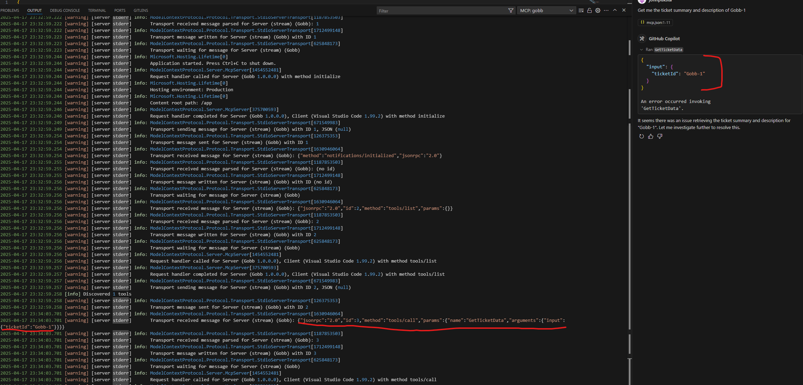

# How to Debug the MCP Server in Visual Studio
The server is configured to read messages in using STDIN, and returns responses to STDOUT. To communicate with the server, you must send jsonrpc formatted messages to STDIN.

For example, to trigger the TicketTool's functionality, you must input a message long the lines of this to STDIN:
{"jsonrpc":"2.0","id":1,"method":"tools/call","params":{"name":"GetTicketData","arguments":{"input":{"ticketId":"Gobb-1"}}}}

# Reading the Console Output from a VSCode Docker MCP Server
Luckily, this message format was easy to figure out by using the console output of VSCode. There are plenty of tutorials to setup running a MCP container in VSCode using docker. When you trigger the MCP server tool to execute, it will log messages to the output console.

For example, the following screenshot shows the console output and how you can easily see the jsonrpc message structure.

Once you have the message structure, it is easy to trigger the MCP server tools.
