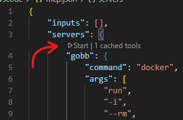
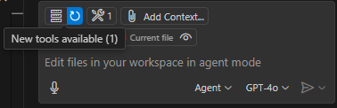
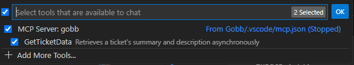
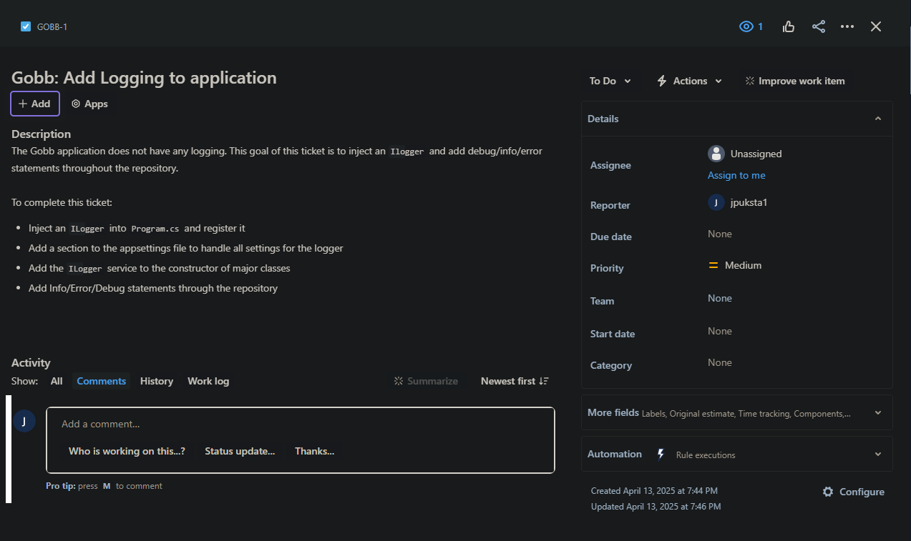
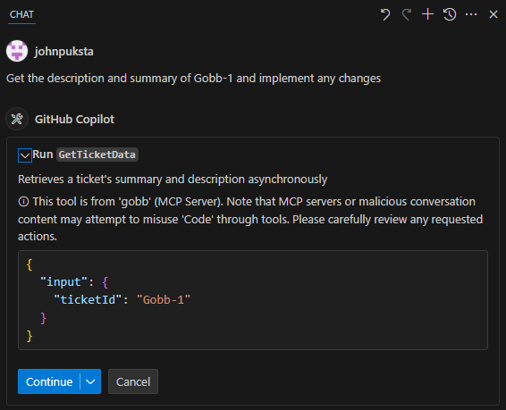
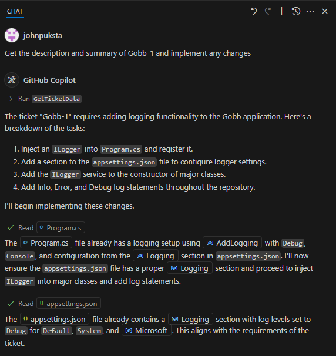

<a id="readme-top"></a>

[![Contributors][contributors-shield]][contributors-url]
[![Forks][forks-shield]][forks-url]
[![Stargazers][stars-shield]][stars-url]
[![Issues][issues-shield]][issues-url]
[![LinkedIn][linkedin-shield]][linkedin-url]

<br />
<div Align="center">
  <h3 Align="center">Gobb MCP</h3>
  <p Align="center">
    A .NET 9.0 MCP Server Tool Suite for Developers.
    <br />
    <a href="https://github.com/johnpuksta/Gobb/issues/new?labels=bug&template=bug-report---.md">Report Bug</a>
    &middot;
    <a href="https://github.com/johnpuksta/Gobb/issues/new?labels=enhancement&template=feature-request---.md">Request Feature</a>
  </p>
</div>

<details>
  <summary>Table of Contents</summary>
  <ol>
    <li>
      <a href="#about-the-project">About The Project</a>
      <ul>
        <li><a href="#built-with">Core Functionality</a></li>
        <li><a href="#built-with">Built With</a></li>
      </ul>
    </li>
    <li>
      <a href="#getting-started">Getting Started</a>
      <ul>
        <li><a href="#prerequisites">Prerequisites</a></li>
        <li><a href="#installation">Installation</a></li>
      </ul>
    </li>
    <li><a href="#roadmap">Roadmap</a></li>
    <li><a href="#license">License</a></li>
    <li><a href="#contact">Contact</a></li>
    <li><a href="#acknowledgments">Acknowledgments</a></li>
  </ol>
</details>

## About The Project
As a Software Engineer, I am constantly trying to improve my development workflow. This is exactly why I created Gobb, which is a [MCP](https://www.anthropic.com/news/model-context-protocol) server that aims to reduce time spent on mundane tasks.

As I have experimented with VS Code's Agent Mode and Cursor, I have been impressed with AI's ability to write code. However, there are a few pieces missing from these Chat Agents that would significantly improve my workflow. The goal of Gobb is to bridge these gaps by providing external functionality through MCP to these LLM agents.

### Core Functionality
Gobb is still early in development, so it is limited in features. Gobb currently includes:
* `TicketTool` - A service to retrieve Tickets/Issues and inject them into an agent's context window.
  * Methods:
    * `GetTicketDataAsync` - A method to retrieve a Ticket's data and summary and return it to the agent.
  * Supported Ticket Systems:
    * Jira
    * GitHub Issues

### Built With
* [![Dotnet][Dotnet]][Dotnet-url]
<p Align="right">(<a href="#readme-top">back to top</a>)</p>

## Getting Started
To get Gobb running locally, follow these steps!

### Prerequisites
The following software/tools need to be installed
* [VS Code][VSCode] (or any IDE with an Agent mode, I have only tested Gobb with VS Code so far)
  * You will need [Agent Mode][VSCodeAgentMode] enabled.
  * This will require you to have a GitHub account to use GitHub Copilot.
* [Docker][Docker]
  * I prefer to use [Docker-Desktop][Docker-Desktop].
* [.NET 9.0][Dotnet-url] - Optional
  * Install this SDK if you want to develop Gobb, otherwise you can just run the docker image.
  * I prefer to use [Visual Studio Community][VisualStudioCommunity] for easy integration with .NET, but you can run `dotnet` commands in VS Code instead.

### Installation
1. Create an [API token][CreateJiraApiToken] to use Jira's API.
2. Open any repository in VSCode and create a `.vscode` folder if it doesn't already exist.
3. Under this folder add a file called `mcp.json`. The following example shows how this should look:
   ``` 
   {
      "inputs": [],
      "servers": {
          "gobb": {
              "command": "docker",
              "args": [
                  "run",
                  "-i",
                  "--rm",
                  "-e", "JiraClientOptions__Url={INSERT_URL}",
                  "-e", "JiraClientOptions__Email={INSERT_EMAIL}",
                  "-e", "JiraClientOptions__ApiToken={INSERT_APITOKEN}",
                  "-e", "TicketClient__Type=Jira",
                  "jpuksta1/gobb"
              ]
          }        
      }
    }
   ```
   This config allows VS Code to execute Gobb's latest image (stored in the [jpuksta1/gobb][GobbRegistry] registry). This config expects the following environment variables:
    1. The JIRA URL that hosts your Ticket data. Example: `https://domain.atlassian.net`
    2. The email that your JIRA account is registered with.
    3. The API Token you just created.
    4. (Optional) If using GitHub as the ticket client:
       - `TicketClient__Type`: Set to `GitHub`.
       - `GitHubClient__RepositoryOwner`: The owner of the GitHub repository.
       - `GitHubClient__RepositoryName`: The name of the GitHub repository.

4. Once `mcp.json` is set up, there should be a "Start" option that appears in the config.

    

    Once started, you should see this wrench icon in your Agent chat window.
    
    > Note: Make sure that you have Agent Mode selected, otherwise this will not appear.
   
    If you click on the wrench icon, you will be able to see Gobb and it's available methods!
    

5. Interact with your Agent chat window to call Gobb:
    For this demonstration, I have created a simple Jira Ticket: Gobb-1, which looks like this:
    

    When I tell Copilot to get the summary and description of this ticket, it will call my Gobb MCP server:
    

    Click "Continue", and watch the magic:

    

6. Continue Vibe Coding and Interact with your Agent to tell it to keep/undo changes!

7. __Optional:__ If you want to locally debug Gobb, then you will need to inject the URL, Email, and ApiToken in the `appsettings.json` file. Notes on how to debug can be found under [Debug Notes](Documents/DebugNotes.md).
 
    Gobb supports dynamic selection of ticket providers (Jira or GitHub). To configure this, update the `appsettings.json` file or set environment variables as needed.

    #### appsettings.json Example
    ```json
    {
      "TicketClient": {
        "Type": "Jira" // Change to "GitHub" to use GitHubClient
      },
      "GitHubClient": {
        "RepositoryOwner": "your-repo-owner",
        "RepositoryName": "your-repo-name",
      }
    }
    ```
- **`Type`**: Specifies the ticket provider to use. Set to `Jira` for Jira integration or `GitHub` for GitHub integration.
- **`GitHubClient`**: Only required if `Type` is set to `GitHub`. Configure the repository owner, name, and token here.


#### Other appsettings.json Configuration
In addition to the dynamic ticket provider configuration, the `appsettings.json` file includes the following settings:

- **`Logging`**: Configures the logging levels for the application.
  - `Default`: The default logging level for the application.
  - `System`: The logging level for system-related logs.
  - `Microsoft`: The logging level for Microsoft-related logs.

- **`JiraClientOptions`**: Contains the configuration for connecting to Jira.
  - `Url`: The base URL of your Jira instance (e.g., `https://domain.atlassian.net`).
  - `Email`: The email address associated with your Jira account.
  - `ApiToken`: The API token for authenticating with Jira.

These settings are essential for the application's functionality and should be configured according to your environment.

<p Align="right">(<a href="#readme-top">back to top</a>)</p>

## Roadmap
I plan to fill this out as I come up with more use-cases of MCP for my personal development workflow, or if I get any good suggestions.
- [ ] Add Ability to Create JIRA tickets
- [ ] Support GitHub's ticket system
- [ ] Explore/Support integrating git operations
- [ ] Explore/Support LSP to easily address Errors/Warnings/etc

See the [open issues](https://github.com/johnpuksta/Gobb/issues) for a full list of proposed features (and known issues).

<p Align="right">(<a href="#readme-top">back to top</a>)</p>

## License
Distributed under the MIT License. See `LICENSE` for more information.

<p Align="right">(<a href="#readme-top">back to top</a>)</p>

## Contact
Feel free to connect with me on [LinkedIn][linkedin-url]! 

<p Align="right">(<a href="#readme-top">back to top</a>)</p>

## Acknowledgments
* [Best-READEME-Template](https://github.com/othneildrew/Best-README-Template) - This is a great template for creating a README!

<p Align="right">(<a href="#readme-top">back to top</a>)</p>

<!-- https://www.markdownguide.org/basic-syntax/#reference-style-links -->
[contributors-shield]: https://img.shields.io/github/contributors/johnpuksta/Gobb.svg?style=for-the-badge
[contributors-url]: https://github.com/johnpuksta/Gobb/graphs/contributors
[forks-shield]: https://img.shields.io/github/forks/johnpuksta/Gobb.svg?style=for-the-badge
[forks-url]: https://github.com/johnpuksta/Gobb/network/members
[stars-shield]: https://img.shields.io/github/stars/johnpuksta/Gobb.svg?style=for-the-badge
[stars-url]: https://github.com/johnpuksta/Gobb/stargazers
[issues-shield]: https://img.shields.io/github/issues/johnpuksta/Gobb.svg?style=for-the-badge
[issues-url]: https://github.com/johnpuksta/Gobb/issues
[linkedin-shield]: https://img.shields.io/badge/-LinkedIn-black.svg?style=for-the-badge&logo=linkedin&colorB=555
[linkedin-url]: https://www.linkedin.com/in/johnpuksta/
[Dotnet]: https://img.shields.io/badge/.NET-5C2D91?style=badge&logo=.net&logoColor=white
[Dotnet-url]: https://dotnet.microsoft.com/en-us/
[VSCode]: https://code.visualstudio.com/download
[VSCodeAgentMode]: https://code.visualstudio.com/blogs/2025/04/07/agentMode
[Docker]: https://www.docker.com/
[Docker-Desktop]: https://www.docker.com/products/docker-desktop/
[VisualStudioCommunity]: https://visualstudio.microsoft.com/vs/community/
[CreateJiraApiToken]: https://id.atlassian.com/manage-profile/security/api-tokens
[GobbRegistry]: https://hub.docker.com/repository/docker/jpuksta1/gobb/general